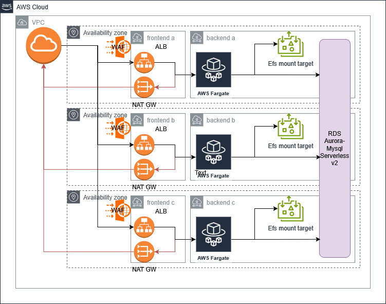

# Sample Wordpress by G.D.

# breve sunto
codice terraform per l'hosting wordpress che integra waf v2 integrato (N.B. override action: count!!) su application load balancer, efs elastic mode, scaling ecs fargate (spot) basato su metrica cpu media, credenziali db salvate su SecretsManager e Aurora Serverless v2 con auto pause mode dopo 300 sec

certificato self-signed caricato su ACM per utilizzo su ALB per esposizione https

N.B. è necessario puntare al dns name dell'application load balancer per poter accedere a wordpress

P.S. dato l'utilizzo di un certificato self signed, si consiglia di utilizzare chrome per la visualizzazione (firefox blocca i contenuti esposti con certificato non valido)

# init
<pre>terraform init</pre>

# provision
<pre>TF_VAR_mysqldb_user=someuser TF_VAR_mysqldb_pass=somepass terraform apply</pre>

# cleanup
<pre>terraform destroy
aws secretsmanager delete-secret --secret-id wordpress_mysqldb_user --force-delete-without-recovery --region eu-west-1
aws secretsmanager delete-secret --secret-id wordpress_mysqldb_pass --force-delete-without-recovery --region eu-west-1</pre>
